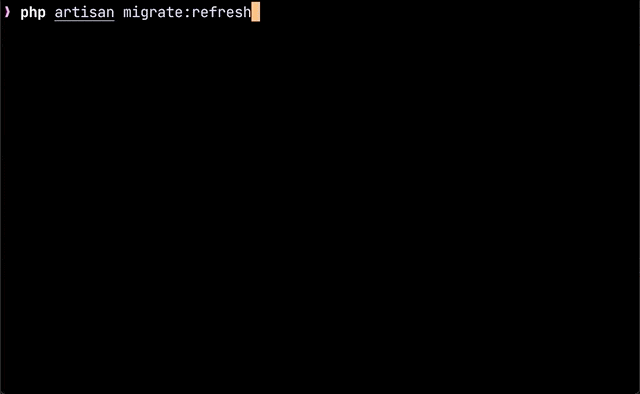

# Schemarkdown

[](https://github.com/MilesChou/schemarkdown/actions/workflows/tests.yml)
[](https://codecov.io/gh/MilesChou/schemarkdown)
[](https://www.codacy.com/manual/MilesChou/schemarkdown)
[](https://packagist.org/packages/MilesChou/schemarkdown)
[](https://packagist.org/packages/MilesChou/schemarkdown)
[](https://packagist.org/packages/MilesChou/schemarkdown)

The core library for generate Markdown document and Laravel Eloquent Model classes from database schema.



## Installation

Use Composer to install:

```bash
composer require mileschou/schemarkdown
```

## Usage

Use following command to generate schema documents:

```bash
cd /path/to/your-laravel-project
php artisan schema:markdown
```

Schema document are stored to `docs/schema` directory default. Use the `--path` option to change it.

In the other framework, you must provide config file like Laravel. Use `--config` option to specify customize configuration.

This tool will load `.env` before load config. Use the `--env` option to specify .env path.

Use the `--database` option to specify **connection name** in Laravel config to generate the document of one database.

Use the `--overwrite` option if you want to overwrite the exists document.

---

Use following command to generate eloquent models:

```bash
cd /path/to/your-laravel-project
php artisan schema:model
```

It's will generate model code into `app/Models` directory (Laravel 8 default), use the `--path` option can change output dir. If want to change namespace, use the `--namespace` option.

In the other framework but using Eloquent ORM library, you must provide config file like laravel project. Use `--config` option to specify customize configuration.

If only want build one connection, use the `--database` option to specify.

Use the `--overwrite` option if you want to overwrite exist code.

## Example

Here is example [SQL](/examples/examples.sql), import MySQL and run following command:

```
php artisan schemarkdown --config=tests/Fixtures/database.php --database=examples --output-dir=examples
```

It will generate this [Markdown documents](/examples).

## Troubleshooting

Use `-vv` option to see info log.

## License

The MIT License (MIT). Please see [License File](LICENSE) for more information.
